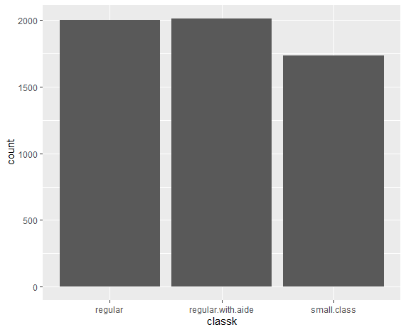

# _Advancing into Analytics_

## This repo along with the book is not finalized and still in production; proceed with caution. 

Data sources and scripts for _Advancing into Analytics: From Excel to R and Python_ by George Mount (O'Reilly, 2021).

Copies of the worked-through workbooks and scripts for each chapter are available in this main folder.

Clean copies of the datasets used in the book along with descriptions and citations can be found in subfolders of the `datasets` folder.
